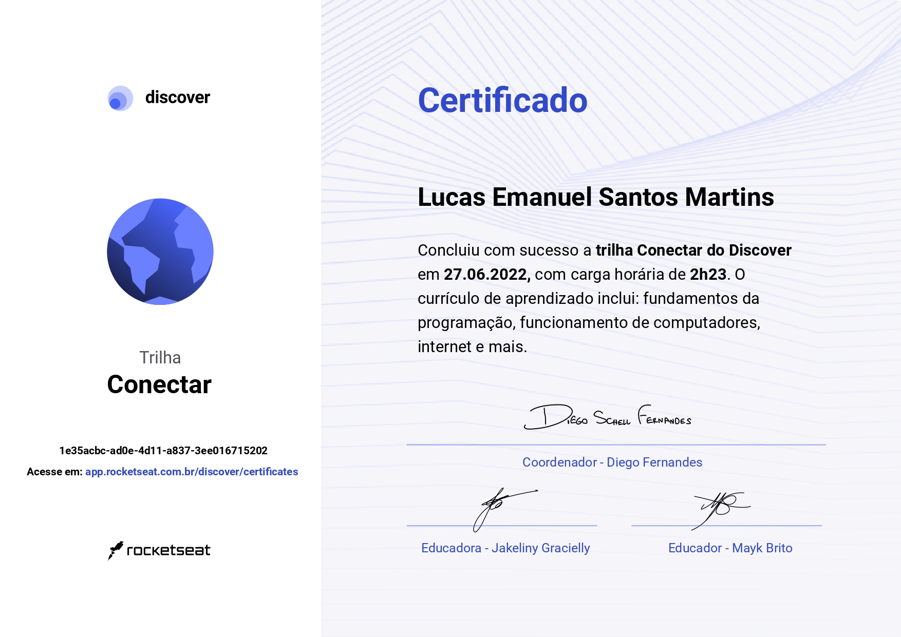
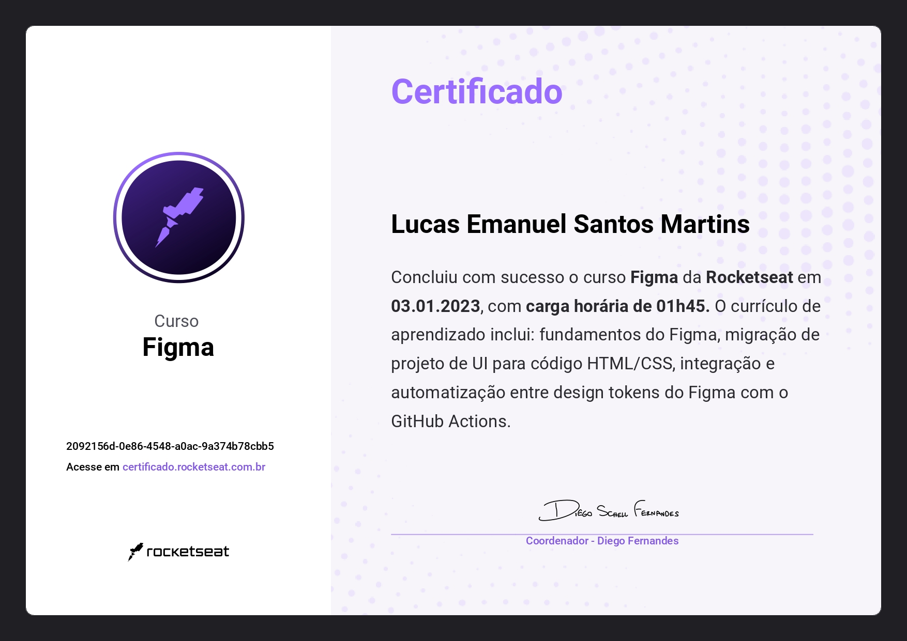

# Oi, sou Lucas Emanuel!
<!--
**LucasE616/Lucase616** is a ✨ _special_ ✨ repository because its `README.md` (this file) appears on your GitHub profile.

Here are some ideas to get you started:

- 🔭 I’m currently working on ...
- 🌱 I’m currently learning ...
- 👯 I’m looking to collaborate on ...
- 🤔 I’m looking for help with ...
- 💬 Ask me about ...
- 📫 How to reach me: ...
- 😄 Pronouns: ...
- ⚡ Fun fact: ...
-->

### --- <a href="##sobre-mim">Sobre</a> | <a href="#tecnlogias-que-uso">Skills</a> | <a href="#stats">Stats</a> | <a href="#my-tools">Tools</a> | <a href="#algumas-certificações">Certificações</a> | <a href="#como-me-encontrar">Contatos</a> ---

## Sobre mim:
- Sou um jovem programador em início de carreira, com o objetivo de ser um Desenvolvedor completo. Hoje estudo e faço projetos Front-end, usando HTML, CSS, JavaScript e Vue.js. Também crio desings no Figma...

- Moro no interior de Minas Gerais, sigo procurando mais oportunidades de prestar meus serviços e me tornar alguém de notoriedade na área.

- Conheci a programação mais a fundo em meio à pandemia, desde então, comecei estudar e praticar as principais tecnologias e Framworks da área.

- Sempre tive contato e facilidade com computadores e eletrônicos, seja desmontando eles(por pura curiosidade kkk), ou consertando coisas dentro de casa, assim consegui meu primeiro emprego, de assistente técnico de manutenção e reparo de computadores.

## Tecnlogias que uso:
  - 

  - 

  - 

  - 

  - 

  - 

  - 

## Stats:
 

## My tools:
  - 

  - 

  - 

  - 

## Algumas certificações:
  - 

  - 

## Como me encontrar:
  - 

  - 

  - 

  - 

  - 

  - 
